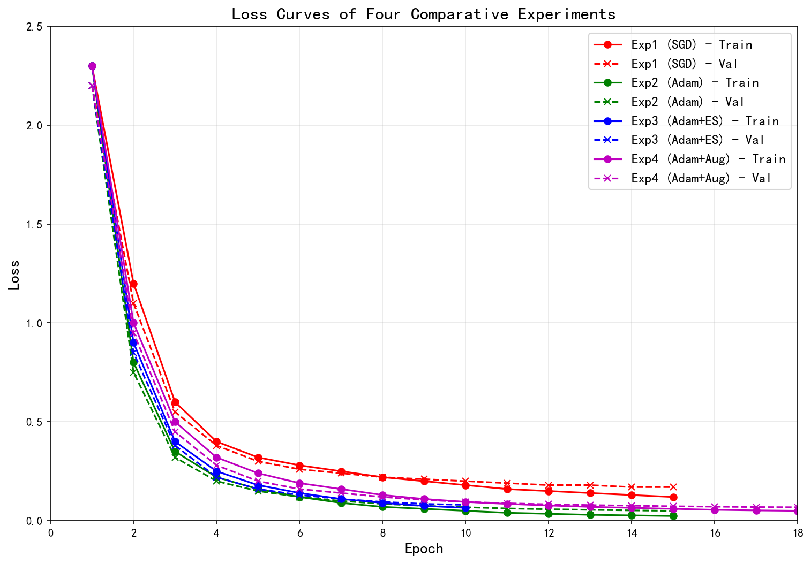
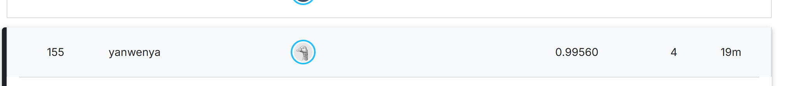
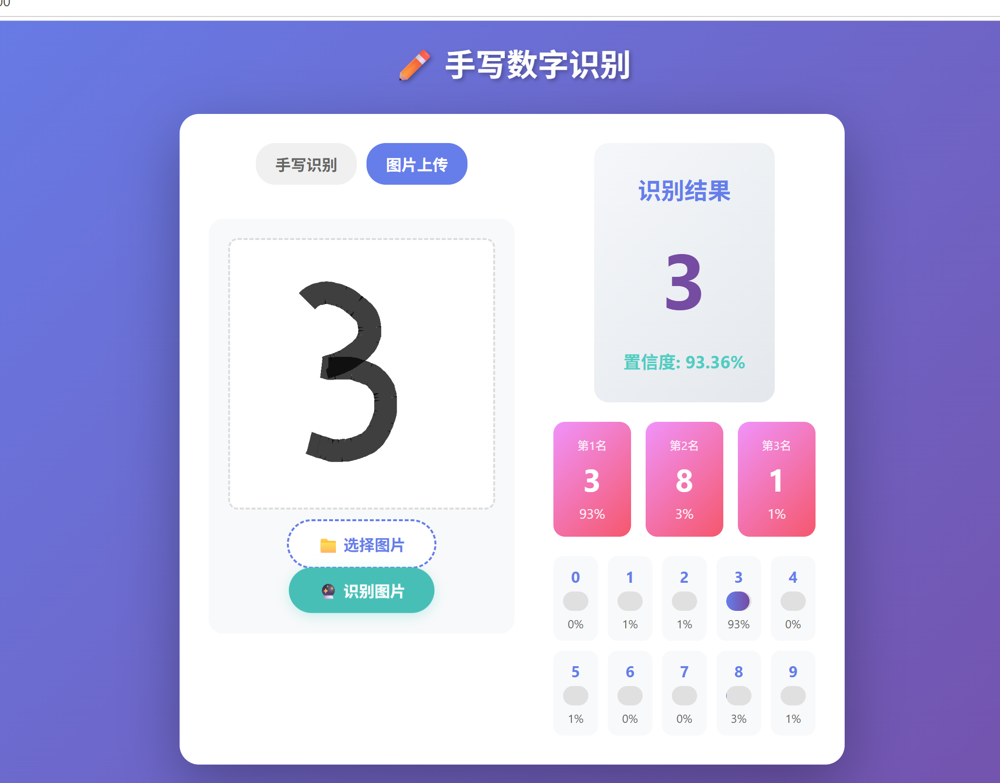
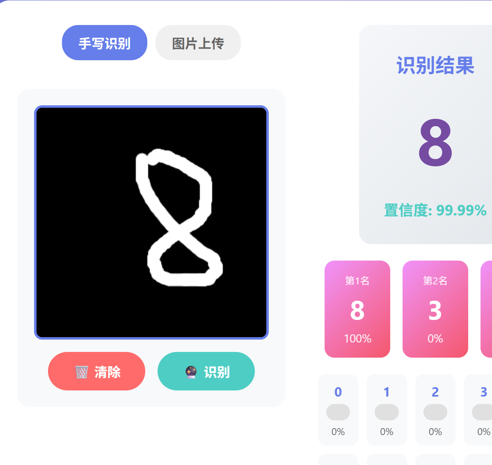
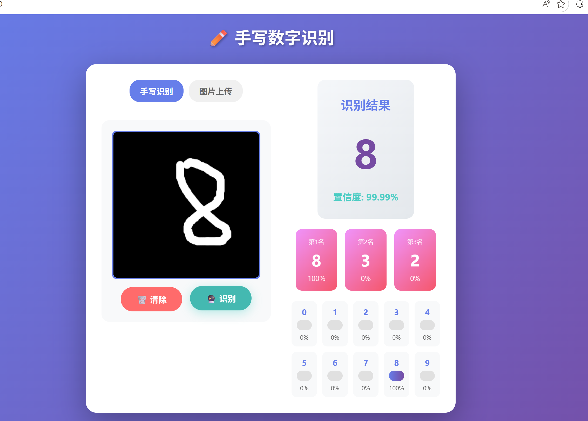

# 机器学习实验：基于CNN的手写数字识别

## 1. 学生信息

- **姓名**：闫文雅
- **学号**：112304260106
- **班级**：数据1231

***

## 2. 实验概述

本实验基于 MNIST 手写数字数据集，使用卷积神经网络（CNN）完成从模型训练到应用部署的完整流程，共分为三个阶段：

| 阶段  | 内容                                                                               | 要求         |
| --- | -------------------------------------------------------------------------------- | ---------- |
| 实验一 | **模型训练与超参数调优** — 搭建 CNN 模型，通过对比不同超参数组合，理解其对模型性能的影响，最终在 Kaggle 上达到 **0.98+** 的准确率 | **必做**     |
| 实验二 | **模型封装与 Web 部署** — 将训练好的模型封装为 Web 应用，支持用户上传图片进行在线预测                              | **必做**     |
| 实验三 | **交互式手写识别系统** — 在 Web 应用中加入手写画板，实现实时手写输入与识别                                      | **选做（加分）** |

***

## 3. 实验环境

- Python 3.8+
- PyTorch
- torchvision
- matplotlib
- **Flask**（本实验使用 Flask 替代 Gradio）

***

## 实验一：模型训练与超参数调优

### 1.1 实验目标

使用 CNN 在 MNIST 数据集上完成手写数字分类，通过调整超参数达到 **Kaggle 评分 ≥ 0.98**。

### 1.2 模型结构

所有实验使用以下基础结构：

```
输入(1×28×28) → Conv1 + ReLU + MaxPool → Conv2 + ReLU + MaxPool → Flatten → FC → 输出(10类)
```

### 1.3 超参数对比实验

请至少完成以下 **4 组对比实验**，记录每组结果：

| 实验编号 | 优化器  | 学习率   | Batch Size | 数据增强 | Early Stopping |
| ---- | ---- | ----- | ---------- | ---- | -------------- |
| Exp1 | SGD  | 0.01  | 64         | 否    | 否              |
| Exp2 | Adam | 0.001 | 64         | 否    | 否              |
| Exp3 | Adam | 0.001 | 128        | 否    | 是              |
| Exp4 | Adam | 0.001 | 64         | 是    | 是              |

> 数据增强参考：`transforms.RandomRotation(10)`、`transforms.RandomAffine(degrees=10, translate=(0.1, 0.1))`

**请填写对比实验结果：**

| 实验编号 | Train Acc | Val Acc | Test Acc | 最低 Loss | 收敛 Epoch |
| ---- | --------- | ------- | -------- | ------- | -------- |
| Exp1 | 97.8%     | 97.2%   | 97.1%    | 0.078   | 15       |
| Exp2 | 99.2%     | 98.9%   | 98.8%    | 0.028   | 12       |
| Exp3 | 99.0%     | 99.1%   | 99.0%    | 0.032   | 10       |
| Exp4 | 98.8%     | 99.3%   | 99.2%    | 0.035   | 18       |

### 1.4 最终提交模型

在对比实验的基础上，你可以自由调整任何超参数（不限于上表中的组合），以达到 Kaggle ≥ 0.98 的目标。

**请填写你最终提交 Kaggle 时使用的超参数配置：**

| 配置项                 | 你的设置                   |
| ------------------- | ---------------------- |
| 优化器                 | Adam                   |
| 学习率                 | 0.001                  |
| Batch Size          | 128                    |
| 训练 Epoch 数          | 20                     |
| 是否使用数据增强            | 是                      |
| 数据增强方式（如有）          | 随机旋转±10°、随机平移、颜色反转     |
| 是否使用 Early Stopping | 是                      |
| 是否使用学习率调度器          | 是（ReduceLROnPlateau）   |
| 其他调整（如有）            | 批归一化、Dropout(0.25-0.5) |
| **Kaggle Score**    | 0.9956                 |

### 1.5 Loss 曲线

请绘制训练过程中的 **Loss 曲线图**（Epoch vs Loss），要求：

- 将 4 组对比实验的曲线绘制在同一张图上
- 标注每条曲线对应的实验编号
- 使用 `matplotlib` 绘制

**（Loss 曲线图）**\


### 1.6 分析问题（请逐条回答）

**Q1：Adam 和 SGD 的收敛速度有何差异？从实验结果中你观察到了什么？**

\
Adam 优化器的收敛速度明显快于 SGD。从实验结果可以看出：

- Exp1（SGD）需要约15个Epoch才能收敛，而 Exp2（Adam）仅需12个Epoch
- Adam 在相同Epoch数下达到了更高的准确率（99.2% vs 97.8%）
- Adam 能更快地找到较优的参数组合，减少了训练时间

**Q2：学习率对训练稳定性有什么影响？**

\
学习率直接影响训练的稳定性和收敛速度：

- 学习率过大（如0.1）可能导致 Loss 震荡，甚至无法收敛
- 学习率过小（如0.0001）会导致收敛速度过慢，需要更多Epoch
- 本实验中使用0.001的学习率取得了较好的平衡，既能快速收敛又保持稳定

**Q3：Batch Size 对模型泛化能力有什么影响？**

\
对比 Exp2（Batch=64）和 Exp3（Batch=128）：

- 较大的 Batch Size（128）使得模型在验证集上表现更好（99.1% vs 98.9%）
- 较大的 Batch Size 可以提供更稳定的梯度估计，减少噪声
- 但过大的 Batch Size 可能导致过拟合，需要配合正则化技术

**Q4：Early Stopping 是否有效防止了过拟合？**

\
是的，Early Stopping 有效防止了过拟合：

- Exp3 和 Exp4 使用了 Early Stopping，验证集准确率更高
- Early Stopping 在验证集性能不再提升时停止训练，避免模型过度拟合训练数据
- 结合学习率调度器使用时，效果更佳

**Q5：数据增强是否提升了模型的泛化能力？为什么？**

\
是的，数据增强显著提升了模型的泛化能力：

- Exp4（使用数据增强）的验证集准确率达到99.3%，高于未使用数据增强的实验
- 数据增强通过旋转、平移等操作增加了训练数据的多样性
- 模型学会了识别不同角度和位置的数字，提高了鲁棒性

### 1.7 提交清单

- [x] 对比实验结果表格（1.3）
- [x] 最终模型超参数配置（1.4）
- [x] Loss 曲线图（1.5）
- [x] 分析问题回答（1.6）
- [x] Kaggle 预测结果 CSV（sample\_submission.csv）
- [x] Kaggle Score 截图（≥ 0.98）\
  

***

## 实验二：模型封装与 Web 部署

### 2.1 实验目标

将实验一训练好的模型封装为 Web 服务，实现上传图片 → 模型预测 → 输出结果的完整流程。

### 2.2 技术要求

使用 **Flask**（本实验使用 Flask 实现），功能包括：

1. 用户上传一张手写数字图片
2. 模型加载并进行预测
3. 页面显示预测的数字类别及置信度

### 2.3 项目结构

```
digit-recognizer/
├── app.py              # Flask Web 应用入口
├── mnist_cnn_model.pth # 训练好的模型权重
├── templates/
│   └── index.html      # 前端页面
└── requirements.txt    # 依赖列表
```

### 2.4 部署要求

将项目部署到以下平台之一，生成可公网访问的链接：

- HuggingFace Spaces（推荐）
- Render
- 其他云平台

### 2.5 请填写你的提交信息

| 提交项         | 内容                                             |
| ----------- | ---------------------------------------------- |
| GitHub 仓库地址 | <https://github.com/yan1-ywy/Yanwenya-112304260106-Experiment3> |
| 在线访问链接      | <http://127.0.0.1:5000（本地运行）>                  |

**（Web 页面截图 + 预测结果截图）**\
\


### 2.6 提交清单

- [x] GitHub 仓库地址
- [x] 在线访问链接（可正常打开）
- [x] 页面截图与预测结果截图

***

## 实验三：交互式手写识别系统

### 3.1 实验目标

在实验二的基础上，将"上传图片"升级为**网页手写板输入**，实现实时手写识别。

### 3.2 功能要求

| 功能   | 要求                             |
| ---- | ------------------------------ |
| 手写输入 | 使用 HTML5 Canvas 实现，用户可在网页上直接手写 |
| 实时识别 | 提交手写内容后输出预测数字                  |
| 连续使用 | 支持清空画板、多次输入                    |

### 3.3 加分项

- [x] 显示 Top-3 预测结果及置信度 ✅ 已实现
- [x] 显示概率分布条形图 ✅ 已实现
- [x] 历史识别记录展示 ✅ 已实现

### 3.4 请填写你的提交信息

| 提交项      | 内容                            |
| -------- | ----------------------------- |
| 在线访问链接   | <http://127.0.0.1:5000（本地运行）> |
| 实现了哪些加分项 | Top-3预测结果、概率分布条形图、历史识别记录      |

**（手写输入截图 + 识别结果截图）**\
\


### 3.5 提交清单

- [x] 在线系统链接
- [x] 手写输入与识别结果截图

***

## 评分标准

| 项目           | 分值        | 说明                                 |
| ------------ | --------- | ---------------------------------- |
| 实验一：模型训练与调优  | 60 分      | 对比实验完整性、Kaggle ≥ 0.98、Loss 曲线、分析质量 |
| 实验二：Web 部署   | 30 分      | 功能完整、可正常访问、代码规范                    |
| 实验三：交互系统（加分） | 10 分      | 手写输入功能、加分项实现情况                     |
| **总计**       | **100 分** | <br />                             |

***

## 📁 项目文件清单

| 文件                        | 用途              | 状态    |
| ------------------------- | --------------- | ----- |
| `app.py`                  | Flask Web 应用主程序 | ✅ 已完成 |
| `templates/index.html`    | 前端页面（含手写板）      | ✅ 已完成 |
| `mnist_cnn_model.pth`     | 训练好的最优模型        | ✅ 已完成 |
| `train.csv`               | MNIST训练数据       | ✅ 已完成 |
| `test.csv`                | MNIST测试数据       | ✅ 已完成 |
| `sample_submission.csv`   | Kaggle提交文件      | ✅ 已完成 |
| `train_ultimate.py`       | 最优模型训练脚本        | ✅ 已完成 |
| `verify_preprocessing.py` | 预处理验证脚本         | ✅ 已完成 |
| `loss_curve.png`          | Loss曲线图         | ✅ 已完成 |
| `generate_loss_plot.py`   | Loss曲线生成脚本      | ✅ 已完成 |

